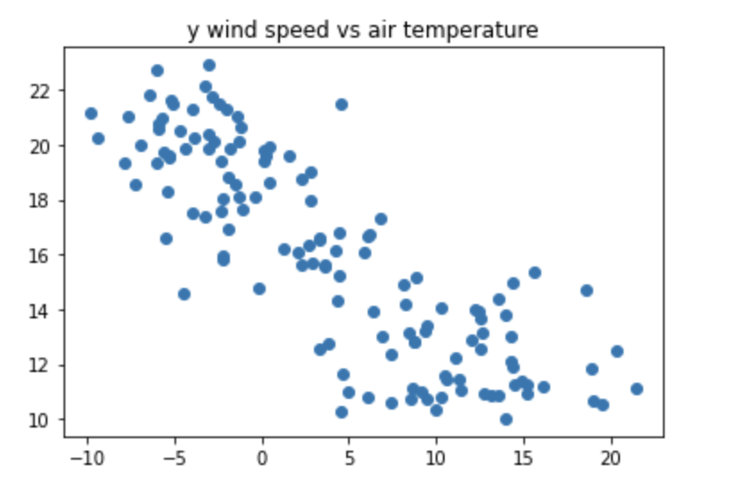
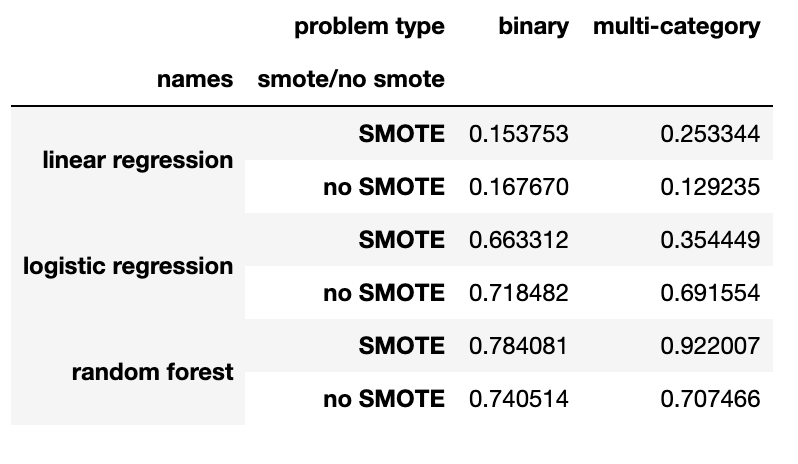

# 🌦️ Predicting Melbourne Weather

This repository contains my Python project for analysing Melbourne weather data and building machine learning models to predict rainfall. The project combines **data cleaning**, **time series transformation**, **feature engineering**, **exploratory data analysis**, and **classification modelling** to compare binary and multi-category rainfall prediction.

---

## 📌 Introduction

This project focuses on predicting Melbourne weather outcomes using Python and machine learning.

Starting from raw weather observations, I cleaned and reformatted the dataset, engineered additional rainfall and wind features, resampled the data to daily frequency, and built models to predict future rainfall using recent historical weather observations.

The project demonstrates practical skills in:

- raw text data cleaning
- datetime handling
- weather feature engineering
- exploratory data analysis
- correlation analysis
- binary and multi-class classification
- class balancing with SMOTE
- model comparison

---

## 💡 Motivation

Weather data is naturally sequential, noisy, and highly dependent on environmental conditions such as temperature, humidity, wind, and pressure. Predicting rainfall is a practical forecasting problem that can help illustrate the value of machine learning on time-based environmental data.

The goal of this project is to:

- transform raw weather observations into an analysis-ready dataset
- investigate relationships between weather variables
- predict whether rainfall will occur
- predict rainfall category levels
- compare different models with and without SMOTE balancing

This project shows how machine learning can be used to model both **binary rainfall occurrence** and **multi-category rainfall intensity**.

---

## 📂 Dataset Description

The project uses a raw text weather dataset:

- `Melbourne01.txt`

The original file includes weather observations such as:

- year
- month
- day
- hour
- minute
- air temperature
- apparent temperature
- dew point temperature
- humidity
- wind direction
- wind speed
- wind gust
- mean sea level pressure
- rainfall measured at 9am

After cleaning and preprocessing, the final modelling dataset includes engineered variables such as:

- `rainfall_diff`
- `X_speed`
- `Y_speed`
- daily aggregated weather variables
- rainfall category bins for the multi-class task

---

## 🧪 Tools and Libraries Used

This project was built using:

- **Python**
- **Pandas**
- **NumPy**
- **Matplotlib**
- **Seaborn**
- **scikit-learn**
- **imbalanced-learn (SMOTE)**

Main modelling tools include:

- `LinearRegression`
- `LogisticRegression`
- `RandomForestClassifier`
- `train_test_split`
- `SelectKBest`
- `SMOTE`

These libraries were used for data cleaning, feature engineering, visualisation, and model evaluation.

---

## 🧹 Data Preparation

Before modelling, the notebook performs several preprocessing steps.

### 1. Import and clean the raw text file
The weather text file is read line by line, cleaned by removing repeated spaces and tabs, and converted into a structured DataFrame.

### 2. Rename and format columns
The raw file is assigned readable column names such as:

- `air_temp`
- `apparent_temp`
- `dew_pt_temp`
- `humidity`
- `wind_speed`
- `wind_gust`
- `mslp`
- `rainfall_9am`

### 3. Handle invalid and missing values
Placeholder values such as:

- `-`
- `-9999`
- `-9999.0`

are converted into missing values so the dataset can be processed more reliably.

### 4. Convert numeric columns
Weather measurements and datetime-related columns are converted into numeric format.

### 5. Create wind vector features
Wind direction and wind speed are transformed into Cartesian components:

- `X_speed`
- `Y_speed`

This improves modelling by converting directional information into usable numeric features.

### 6. Build a datetime index
The year, month, day, hour, and minute columns are combined into a timestamp index.

### 7. Engineer rainfall difference
A new feature called `rainfall_diff` is created from the change in `rainfall_9am`, with negative differences reset to zero.

### 8. Resample to daily frequency
The dataset is aggregated to daily level:
- daily mean for most weather variables
- daily maximum for rainfall and wind gust

### 9. Interpolate missing daily values
Time-based interpolation is used to fill missing values after daily resampling.

### 10. Create rolling sequence lookup
A custom helper class is defined so the model can use the previous few days of observations to predict the next day.

---

## 🔍 Exploratory Data Analysis

The project includes exploratory analysis to better understand relationships between weather variables.

### 1. Correlation analysis
A correlation matrix is created to examine the relationships between weather features such as temperature, humidity, wind, rainfall, and pressure.

### 2. Variable relationship plots
Scatter plots are used to visually inspect pairwise relationships between key variables.

### 3. Monthly trends
Selected weather variables are resampled monthly to explore broader seasonal patterns over time.

---

## 📊 Key Visualisations

### 1. Correlation Heatmap


This heatmap summarizes the relationships between the main weather variables. Strong positive relationships appear between **air temperature**, **apparent temperature**, and **dew point temperature**, while **humidity** shows a negative relationship with temperature. Wind-related variables also show meaningful structure, especially between **wind speed**, **Y_speed**, and **wind gust**. This visual helps identify which variables may be useful for rainfall prediction.

### 2. Y Wind Speed vs Air Temperature



This scatter plot shows a clear negative relationship between **Y wind speed** and **air temperature**. Lower Y-direction wind values are associated with higher temperatures, while higher Y-direction wind values tend to align with cooler conditions. This suggests that wind direction and wind movement may be useful predictors in the weather model.

### 3. Model Comparison Table



This summary table compares model performance across:
- binary rainfall prediction
- multi-category rainfall prediction
- with SMOTE
- without SMOTE

The strongest results come from the **Random Forest** model, especially for the **multi-category problem with SMOTE**, which achieves the highest score of **0.922**. This shows that both model choice and class balancing have a strong effect on predictive performance.

---

## 🤖 Modelling Approach

The project models rainfall in two different ways.

### 1. Binary classification
Rainfall is converted into a binary target:

- `True` if rainfall on the target day is greater than `0.2`
- `False` otherwise

This predicts whether meaningful rainfall occurs.

### 2. Multi-category classification
Rainfall is binned into multiple ranges:

- 0: `(-0.1, 0.2]`
- 1: `(0.2, 5]`
- 2: `(5, 10]`
- 3: `(10, 25]`
- 4: `(25, 60]`

This predicts rainfall intensity class rather than only occurrence.

### 3. Sliding window sequence input
For both tasks, the models use the previous **3 days** of weather data to predict the next day.

### 4. Models tested
The notebook compares:

- Linear Regression
- Logistic Regression
- Random Forest Classifier

### 5. SMOTE balancing
SMOTE is also applied to the binary and multi-category tasks to handle class imbalance and test whether balanced training improves performance.

---

## 📊 Model Results

The final model comparison results are:

| Model | SMOTE | Binary | Multi-category |
|------|------|--------:|---------------:|
| Linear Regression | Yes | 0.153753 | 0.253344 |
| Linear Regression | No | 0.167670 | 0.129235 |
| Logistic Regression | Yes | 0.663312 | 0.354449 |
| Logistic Regression | No | 0.718482 | 0.691554 |
| Random Forest | Yes | 0.784081 | 0.922007 |
| Random Forest | No | 0.740514 | 0.707466 |

### Best-performing models
- **Binary prediction:** Random Forest with SMOTE (`0.784`)
- **Multi-category prediction:** Random Forest with SMOTE (`0.922`)

These results suggest that **Random Forest** is the strongest model for this problem, and **SMOTE** significantly improves multi-category performance.

---

## 📈 Main Insights

The project reveals several key findings:

- temperature-related variables are strongly correlated with one another
- wind and humidity show meaningful relationships with temperature and rainfall-related patterns
- using recent historical weather observations helps predict future rainfall
- Random Forest performs much better than linear regression and logistic regression
- SMOTE improves class balance and gives the strongest results for the multi-category task
- rainfall prediction is more effective when both temporal structure and engineered weather features are included

Overall, the project shows that machine learning can successfully model rainfall occurrence and rainfall intensity from weather observations.

---

## 🛠️ Techniques Used

This project demonstrates the use of:

- raw text parsing
- missing value handling
- feature engineering
- wind direction conversion to Cartesian coordinates
- datetime indexing
- daily resampling
- time interpolation
- sliding-window sequence construction
- correlation analysis
- scatter plot visualisation
- binary classification
- multi-class classification
- SMOTE balancing
- model comparison

---

## 📁 Files

- `Predicting Melbourne Weather.ipynb` – Jupyter notebook containing the full workflow
- `Melbourne01.txt` – raw weather dataset used in the project
- `Screenshot 2026-04-09 at 10.58.37 pm.png` – correlation heatmap
- `Screenshot 2026-04-09 at 10.58.48 pm.png` – scatter plot of Y wind speed vs air temperature
- `Screenshot 2026-04-09 at 10.59.07 pm.png` – model comparison table

---

## ▶️ How to Run the Project

1. Open the notebook in **Jupyter Notebook**, **JupyterLab**, or **VS Code**
2. Make sure `Melbourne01.txt` is in the same working directory
3. Install the required libraries if needed:

```python
pip install pandas numpy matplotlib seaborn scikit-learn imbalanced-learn
